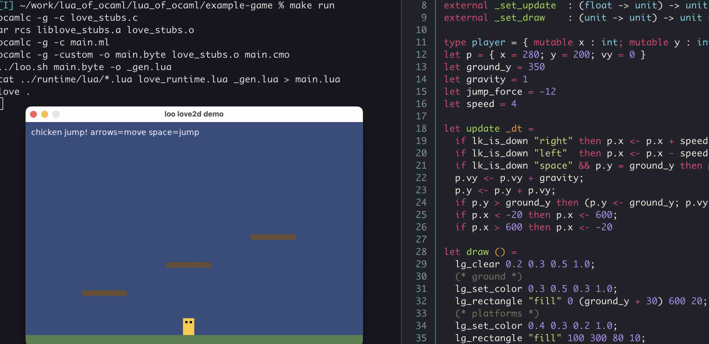

<div class="banner">
  
  <h1>lua_of_ocaml</h1>
  <p class="sub">ocaml &gt;&gt; lua 5.1</p>
</div>

[home](https://maltasea.yoiky.com/lua_of_ocaml) · [source](https://github.com/maltasea/lua_of_ocaml)

Compiles OCaml bytecode programs to Lua 5.1, inspired by js_of_ocaml.

> **Note:** this project was written in a heavily guided, multi-hour
> chat session with Claude Code. Most of it with Model: Deepseek v4.0, and some Opus 4.7 — nothing agentic.

## first steps

### install

    opam install js_of_ocaml-compiler
    git clone git@github.com:maltasea/lua_of_ocaml.git
    cd lua_of_ocaml
    dune build

### run hello world

    echo 'let () = print_endline "hello from lua"' > hello.ml
    make hello

    hello from lua

### your own programs

Edit `hello.ml`, then `make hello`.

### any bytecode

    ./loo.sh prog.ml              # .ml → stdout
    ./loo.sh prog.ml out.lua      # .ml → out.lua
    lua out.lua

`./loo.sh` is generated by `make` — no install needed.

## how it works

<div class="arch">
ocaml source<br>
&nbsp;→ ocamlc → bytecode<br>
&nbsp;&nbsp;→ jsoo parser (reused)<br>
&nbsp;&nbsp;&nbsp;&nbsp;→ IR (Code.program)<br>
&nbsp;&nbsp;&nbsp;&nbsp;&nbsp;&nbsp;→ generate_lua.ml → Lua AST<br>
&nbsp;&nbsp;&nbsp;&nbsp;&nbsp;&nbsp;&nbsp;&nbsp;→ output_lua.ml → .lua text<br>
&nbsp;&nbsp;&nbsp;&nbsp;&nbsp;&nbsp;&nbsp;&nbsp;&nbsp;&nbsp;+ runtime/lua/*.lua<br>
&nbsp;&nbsp;&nbsp;&nbsp;&nbsp;&nbsp;&nbsp;&nbsp;&nbsp;&nbsp;→ luajit hello.lua
</div>

The IR from js_of_ocaml is target-agnostic. lua_of_ocaml reuses the bytecode parser and optimizations, and provides a structural CFG code generator modeled on js_of_ocaml's generate.ml.

## files

| file | what |
|---|---|
| `compiler/lib/lua.ml` | lua 5.1 ast |
| `compiler/lib/output_lua.ml` | lua pretty printer |
| `compiler/lib/generate_lua.ml` | ir → lua |
| `compiler/bin-lua_of_ocaml/` | cli tool |
| `runtime/lua/*.lua` | lua runtime |
| `test/` | tests |

## ffi: ocaml talking to lua

`external` becomes a direct lua call. dummy c stub for linking.

    (* mylib.ml *)
    external lua_add : int -> int -> int = "lua_add"

    /* mylib_stubs.c — just so ocamlc links */
    #include <caml/mlvalues.h>
    CAMLprim value lua_add(value a, value b) { return Val_int(0); }

    ocamlc -c mylib_stubs.c
    ocamlc -c mylib.ml
    ocamlc -custom -o mylib.byte mylib_stubs.o mylib.cmo
    ./loo.sh mylib.byte -o mylib.lua

### value representation contract

The lua-side function receives ocaml values in the encoded form below.
Return values must use the same encoding or the compiled caller will
misinterpret them.

| ocaml type | lua representation | notes |
|---|---|---|
| `int`        | `n * 2`              | tag bit; recover with `math.floor(v / 2)` |
| `bool`       | `0` (false), `2` (true) | lua `false`/`true` from externals also accepted in conditionals |
| `char`       | `code * 2`           | lua byte 0..255, encoded as int |
| `float`      | `{253, v}`           | boxed; `v` is a plain lua number |
| `string`     | plain lua string     | immutable |
| `bytes`      | `{ str }`            | single-cell table; mutate `t[1]` to rebind |
| `unit`       | `0`                  | same encoding as `()` |
| `'a list`    | `0` (nil) or `{0, hd, tl}` | tag 0, head, tail |
| `'a option`  | `0` (None) or `{0, x}` | tag 0 for Some |
| `'a array`   | `{0, a0, a1, ...}`   | tag 0 then elements |
| variant `A \| B of int \| ...` | `0`, `2`, ... (no-arg) or `{tag, fields...}` (with args) | const variants are encoded ints; block variants use their tag |
| record `{f1; f2}` | `{0, v1, v2}`   | tag 0, fields in declaration order |
| tuple `(a, b)` | `{0, a, b}`        | same shape as a tag-0 record |
| function `f` | lua function        | `caml_arity[f]` tracks param count for partial application |

When writing the lua side of an `external`, unwrap inputs and box outputs:

```lua
function lua_add(a, b)
  -- a, b are encoded ints
  return a + b              -- tagged + tagged stays tagged; ok
end

function lua_dist(p_box, q_box)
  -- floats are boxed
  local p, q = p_box[2], q_box[2]
  return { 253, math.sqrt((p - q) * (p - q)) }
end
```

OCaml callbacks (e.g. `external _set_update : (float -> unit) -> unit`)
arrive as lua functions; call them with `caml_call_gen(cb, arg)` so
partial/over-application matches OCaml's curried semantics.

Real example: [example-game/](example-game/) — löve2d chicken jump.
`love_runtime.lua` unwraps encoded ints/floats before calling the real
LÖVE API; that's the canonical reference pattern.

## source tracing

generated lua has `--# file:line` markers. use `ocamlc -g`.

## tests

    make test                          # 26 tests
    bash test/behavioral/run.sh        # 5 behavioral tests

## license

lgpl-2.1-or-later with ocaml-lgpl-linking-exception (same as jsoo)

<div class="footer">
  <small>made in a long chat with claude code — nothing agentic, just vibes</small>
  <br><br>
  <small>lua_of_ocaml — ocaml → lua 5.1</small>
</div>
